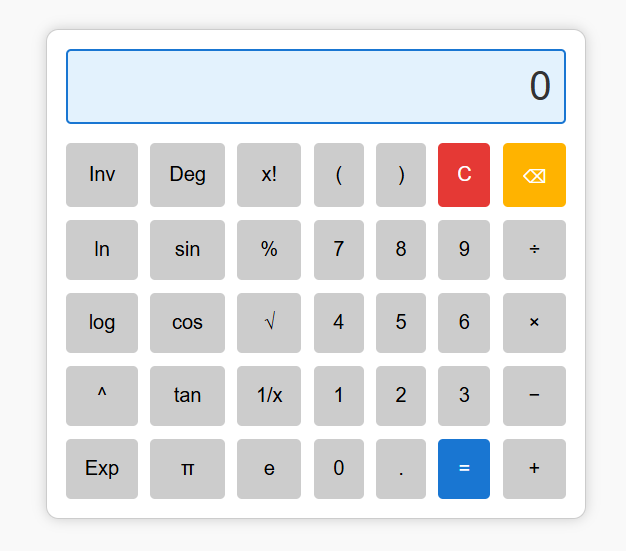

# 🧮 Scientific Calculator Web App

A user-friendly scientific calculator built with **HTML**, **CSS**, and **JavaScript**. This app mimics the functionality and design of a real scientific calculator, supporting both basic and advanced mathematical operations.

## 📸 Preview

## 🚀 Features

- ✅ Basic arithmetic operations: `+`, `−`, `×`, `÷`
- 🧠 Scientific functions: `sin`, `cos`, `tan`, `log`, `ln`, `√`, `^`, `Exp`
- 🔢 Constants: `π`, `e`
- 🧮 Additional operations: `x!` (factorial), `%`, `1/x`
- ⌫ Backspace & `C` (clear)
- ✨ Styled with a modern and responsive UI

## 🛠️ Tech Stack

- **HTML5** – structure
- **CSS3** – layout and styling
- **Vanilla JavaScript** – calculator logic and interactivity

## 📂 Project Structure

